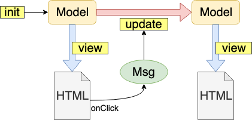

## Elmハンズオン

2019-07-26

---

## Elmってどんな言語？

- 純粋関数型
- JavaScript + HTML にコンパイルされる
- 言語内フレームワーク(The Elm Architecture)
- 実行時エラーが発生しない

---


## つまり？

安全で関数型が学べててげ楽しい！

---

## 時間割

- 準備＆座学 (20min)
- 課題1 (30min)
- 質問 ＆ 休憩 (10min)
- 課題2 (50min)
- 振り返り (10min)


---

## 感謝

場所の提供ありがとうございます！！！

---

## ソースコード

https://github.com/mather/elm-handson

- ローカルで試す方は `git clone` しましょう
- オンラインエディタで試す方はブラウザで開いてソースコードを随時コピーします

+++

## 準備(インストール)

- Homebrew : `brew install elm elm-format`
- npm : `npm i -g elm elm-format`
- インストーラー(Mac, Win)
    - https://guide.elm-lang.org/install.html
    - 僕は使ったことがない（汗
- 自分の好きなエディタでガシガシ試したい人はローカルへインストールしてください
- Atom + elmjutsu おすすめ

+++

## 準備(オンラインエディタを使う)

- 公式サイト : https://elm-lang.org/try
- Ellie **(推奨)** : https://ellie-app.com

+++

## ローカルで試す

```
$ cd ex1-countup/
$ elm reactor
Go to <http://localhost:8000> to see your project dashboard.
```

http://localhost:8000 へアクセスして `src` -> `countup.elm` を選択する

`elm reactor` がリクエストを受けて自動コンパイルするので、ブラウザをリロードすればOK

+++

## オンラインエディタで試す

`ex1-countup/src/countup.elm` の内容をコピーして貼り付ける

"compile" ボタンをクリックするとコンパイルしてくれる

Ellieの場合は "debug" ボタンを押すとデバッグウィンドウを出してくれる

---

## The Elm Architecture

アプリケーションのライフライクルの定義

- `init` : 初期状態
- `view` : ある状態をHTMLで表現する
- `update` : アクションに対応して状態を次の状態に変更する

+++

## ライフサイクルのイメージ



---

## elm repl

ローカルにインストールするとREPLが使える

```
$ elm repl
> :help
Valid commands include:

  :exit    Exit the REPL
  :help    Show this information
  :reset   Clear all previous imports and definitions

More info at <https://elm-lang.org/0.19.0/repl>
> 1 + 2
3 : number
> Just 3 |> Maybe.map (\x -> x + 1)
Just 4 : Maybe number
```

---

## Elm のドキュメント類

- 公式ドキュメント : https://elm-lang.org/docs
- パッケージ一覧 : https://package.elm-lang.org/

---

## 課題1

ボタンを押すとカウントアップするアプリケーション

フォルダ : `ex1-countup`

+++

## 課題1のデモ

+++

## main関数

The Elm Architecture に必要な関数をセットする

```elm
main =
    Browser.sandbox
        { init = init
        , update = update
        , view = view
        }
```

+++

## Model, init

```elm
-- Model : アプリケーションの状態を Model 型として定義する
type alias Model =
    Int

-- init : モデルの初期状態を与える
init : Model
init =
    0
```

+++

## Msg, update

```elm
-- Msg : アプリケーション内で発生するアクションを定義
type Msg
    = Increment

-- update : アクション(Msg)が発生したときに、現在のモデルから新しいモデルを作る関数
update : Msg -> Model -> Model
update msg model =
    case msg of
        Increment ->
            model + 1
```

+++

## view

```elm
view : Model -> Html Msg
view model =
    div []
        [ p [] [ text <| String.fromInt model ]
        , button [ onClick Increment ] [ text "+1" ]
        ]
```

---

## 課題1のミッション

- カウントをリセットする(0に戻す)ボタンを追加する

+++

## 「リセットする」アクションの追加

```elm
-- Msg : アプリケーション内で発生するアクションを定義
type Msg
    = Increment
    | Reset
```

+++

## コンパイルエラー

コンパイルエラーが丁寧すぎるくらい丁寧

```
-- MISSING PATTERNS ------------------------------------------------ countup.elm

This `case` does not have branches for all possibilities:

52|>    case msg of
53|>        Increment ->
54|>            model + 1

Missing possibilities include:

    Reset

I would have to crash if I saw one of those. Add branches for them!

Hint: If you want to write the code for each branch later, use `Debug.todo` as a
placeholder. Read <https://elm-lang.org/0.19.0/missing-patterns> for more
guidance on this workflow.
```

+++

## updateのパターンを追加する

```elm
update : Msg -> Model -> Model
update msg model =
    case msg of
        Increment ->
            model + 1

        Reset ->
            0
```

ひとまず動くけど、まだボタンがないのでリセットできない

+++

## リセットボタンの追加

```elm
view : Model -> Html Msg
view model =
    div []
        [ p [] [ text <| String.fromInt model ]
        , button [ onClick Increment ] [ text "+1" ]
        , button [ onClick Reset ] [ text "Reset" ]
        ]
```

リセットできるようになった

+++

# 完

- 追加ミッション(時間と気力に余裕がある人はぜひ自分で解いてみてね)
    - カウントを下げる(Decrement)ボタンを追加する
    - 0以下にカウントが下がらないようにする
    - `if` を使わない

---

## 質問 & 休憩

---

## 課題2

インクリメントサーチ

+++

## 課題2のデモ

---

## 課題2のソースコード

`ex2-incremental-search/src/search.elm`

- オフラインで試す人はディレクトリを移動して `elm reactor`
- オンラインエディタの人は内容をコピーして貼り付け


